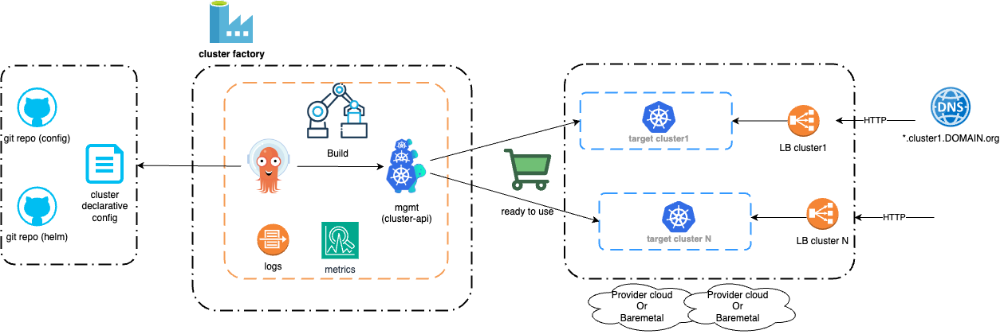

# k8s-cluster-api-starter

To build kubernetes images and deploy cluster-api clusters on Openstack cloud or Outscale cloud
Useful helm-charts configuration files and build scripts 

For more details see the directories
- helm-charts: manages the lifecycle of a Kubernetes clusters on different cloud using Cluster API.
- image-builder: to build and customize kubernetes node images for different cloud
- docs

Tested on:
- openstack
- outscale (in progress)

## Principle

## Documentation reference:

Image builder:
- https://image-builder.sigs.k8s.io/capi/container-image
- https://image-builder.sigs.k8s.io/capi/providers/openstack-remote
- https://image-builder.sigs.k8s.io/capi/providers/3dsoutscale
- https://github.com/kubernetes-sigs/image-builder

cluster-api:
- https://cluster-api.sigs.k8s.io/

cluster-api provider:
- Openstack:
  - https://cluster-api-openstack.sigs.k8s.io/
  - https://github.com/kubernetes-sigs/cluster-api-provider-openstack
- Outscale:
  - https://cluster-api-outscale.oos-website.eu-west-2.outscale.com/
  - https://github.com/outscale/cluster-api-provider-outscale
