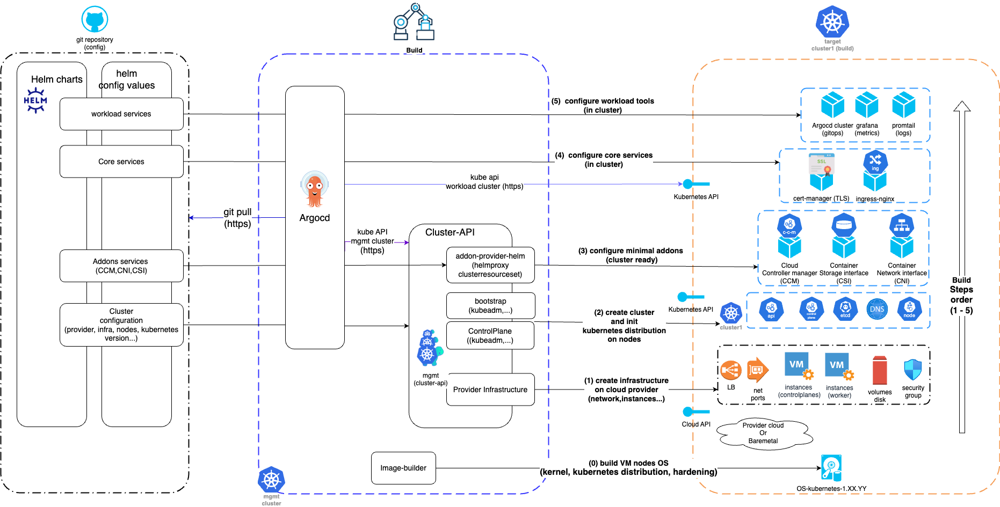

# Deploy cluster-api on cloud

## Promise

## Principle

## Multi provider

## Factory

## cluster template
[cluster template](cluster-template.md)

## cluster-api with helm chart

See helm-charts directory
