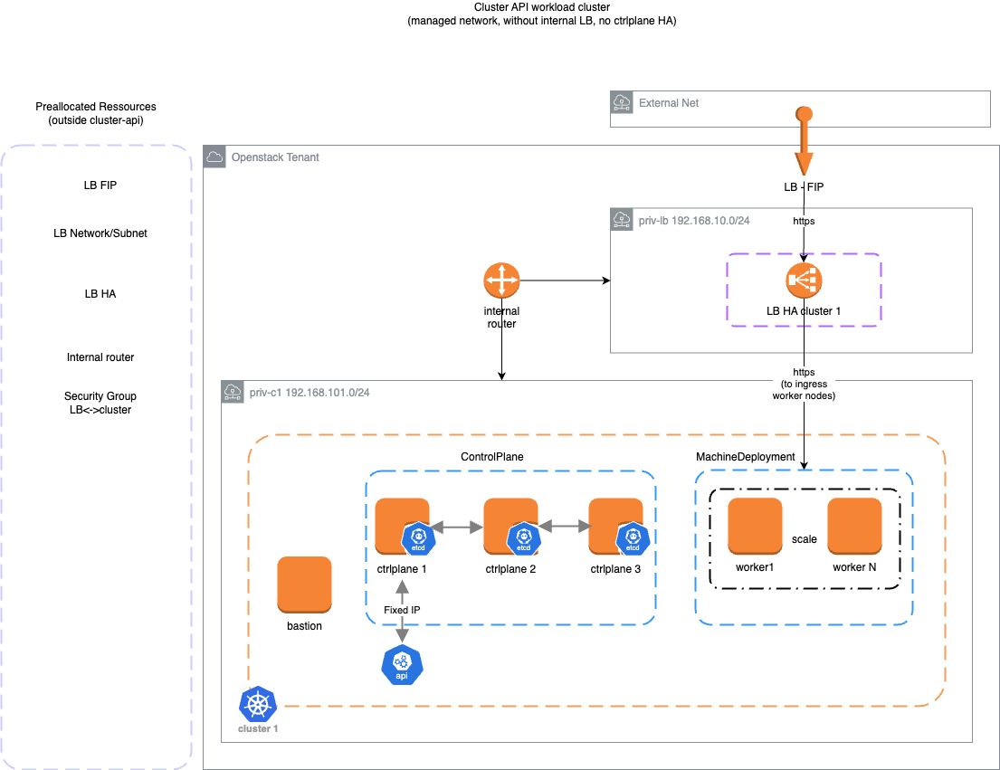
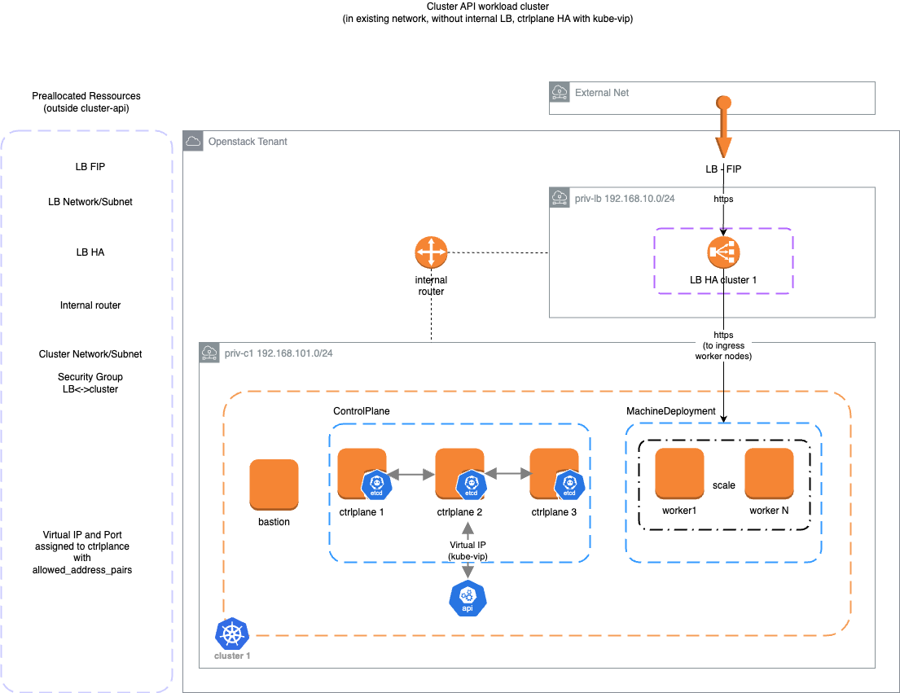
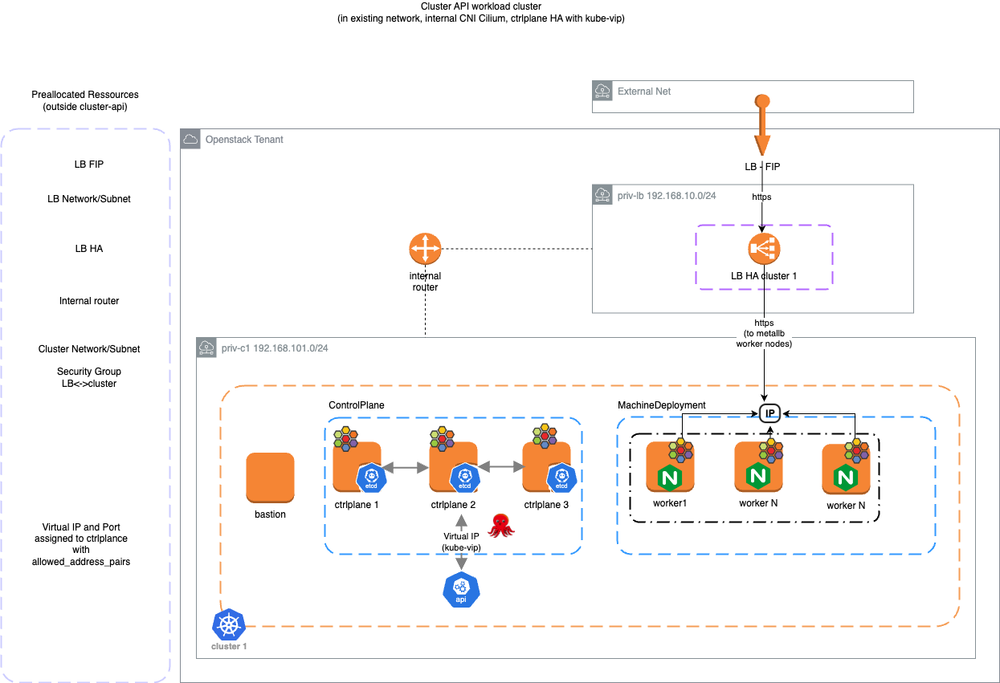
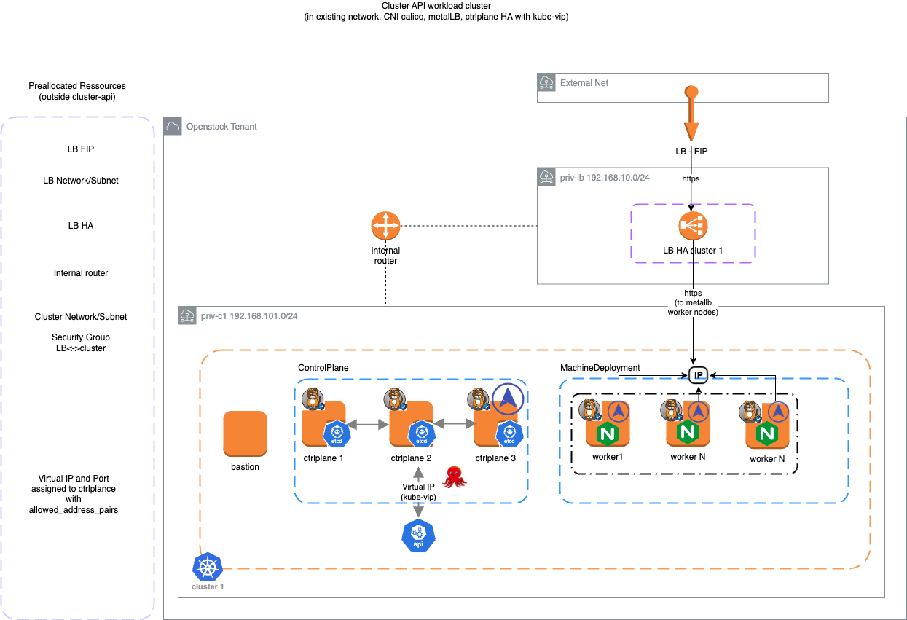

# Deploy cluster-api on cloud

## Openstack Cloud Cluster templates

cluster-templates are available

The following workload cluster infrastructures have been tested in openstack cloud

- managed subnet, without LBaaS, without ctrlplane HA

- existing network, without LBaaS, HA ctrlplane with kube-vip

- existing subnet, with cilium LB for workload traffic, with API HA with kube-vip

- existing subnet, with calico + LB metallb for workload traffic, with API HA with kube-vip

## Outscale Cloud Cluster templates

https://blog.outscale.com/en/developing-a-cluster-api-provider-at-outscale/
