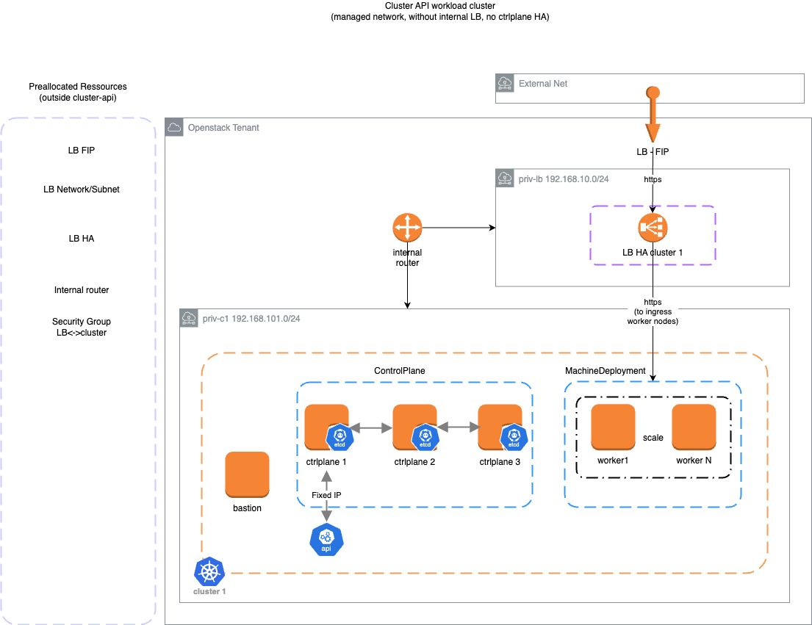
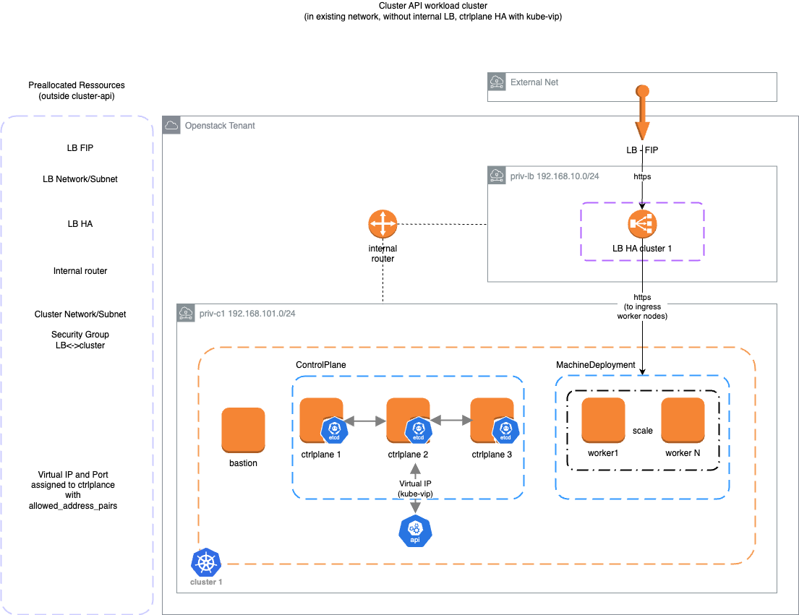

# deploy cluster-api openstack

The following steps must run on an instance with:
  - install prereq: yq, env.rc
  - install clusterctl
  - install kind, kubectl, helm: use github.com/numerique-gouv/dk8s install prereq scripts
  - acces to openstack API
  - openstack credentials (`OS_*`)
  - internet acces (`http_proxy`)
  - dns server: to resolve openstack API if needed (ex: unbound)


In this example, we use predefined resources
 - private openstack cloud
 - internet access through internal `http_proxy`
 - openstack API access through `http_proxy`
 - existing instances: bastion, `http_proxy` and dns resolver
 - existing router, network, subnet
 - cluster mgmt is installed on bastion instance
 - workload cluster will be deployed in existing subnet

# prepare mgmt instance

```bash
# source `proxy` conf (if needed)
export HTTP_PROXY=http://proxy.internal:8888
export HTTPS_PROXY=http://proxy.internal:8888
export NO_PROXY=localhost,192.168.0.0/16
export http_proxy=http://proxy.internal:8888
export https_proxy=http://proxy.internal:8888
export no_proxy=localhost,192.168.0.0/16

# install some tools (kind, kubectl...)
curl -L https://raw.githubusercontent.com/numerique-gouv/dk8s/main/scripts/install-prereq.sh | bash

# install clusterctl
curl -L https://github.com/kubernetes-sigs/cluster-api/releases/download/v1.7.0/clusterctl-linux-amd64 -o clusterctl
chmod +x clusterctl
sudo mv clusterctl /usr/local/bin/clusterctl

# install yq
curl -LO https://github.com/mikefarah/yq/releases/download/v4.43.1/yq_linux_amd64.tar.gz
tar -zxvf yq_linux_amd64.tar.gz  ./yq_linux_amd64
rm -rf yq_linux_amd64.tar.gz
chmod +x yq_linux_amd64
sudo mv yq_linux_amd64 /usr/local/bin/yq

# download env.rc script
curl -LO https://raw.githubusercontent.com/kubernetes-sigs/cluster-api-provider-openstack/master/templates/env.rc

# download create_cloud_conf
curl -LO https://raw.githubusercontent.com/kubernetes-sigs/cluster-api-provider-openstack/main/templates/create_cloud_conf.sh
```

- get ca.crt used for your openstack API access (https)
- source your openstack creds (OS_PASSWORD is needed)
- create clouds.yaml (including cacert key)
```
cat sample-clouds.yaml |envsubst > clouds.yaml
```
- generate all openstack variables to configure cluster (ex: capi-openstack.rc)
- generate other OPENSTACK_ variable, to build cluster-api from template, with env.rc script
```
( source env.rc clouds.yaml openstack ; env |grep OPE) >> capi-openstack.rc
```

# create mgmt cluster
- configure docker (with access to pull image , http_proxy)
- kind create (with docker)
```
kind create cluster --name mgmt
```
- wait pods ready
- clusterctl init --infrastructure openstack
```
clusterctl init --infrastructure openstack --addon helm
```
- wait pods ready
- if needed, configure capo pod (cluster api openstack) to contact openstack API with `http_proxy` env
```
bash configure_capo.sh
```

# Create workload configuration
- generate cluster config from template (without lb)

```
clusterctl generate cluster capi-quickstart --flavor without-lb --kubernetes-version v1.26.7 --control-plane-machine-count=1 > capi-quickstart.yaml
```

- customize the template to feet cluster/node configuration

In this example:
  - disable bastion and floating ip for api
  - use existing network/subnet/router/ip
  - fix private API ip adress
  - security-group
  - root volume, etc...

```yaml
#
# sample customization
#
apiVersion: infrastructure.cluster.x-k8s.io/v1beta1
kind: OpenStackCluster
metadata:
  name: capi-quickstart
  namespace: default
spec:
  ## Debug: disable bastion
  bastion:
    enabled: false
  ## Debug: api IP
  #apiServerFloatingIP: 100.10.10.10
  disableAPIServerFloatingIP: true
  apiServerFixedIP: 192.168.2.100
#
# Debug: (quick deploy) use existing network/subnet/router
#
  network:
    filter:
      name: network_services
  subnets:
    - filter:
        name: subnet_services
  router:
    filter:
      name: router_services
  ## Debug: no floating ip
  disableExternalNetwork: true
#  externalNetwork:
#    id: 129e7506-6bc0-4722-aec7-99b4d8430ec3
  ## Debug: disable managed subnet if existing subnet is used
#  managedSubnets:
#  - cidr: 192.168.4.0/24
#    dnsNameservers:
#    - 192.168.2.10

apiVersion: infrastructure.cluster.x-k8s.io/v1beta1
kind: OpenStackMachineTemplate
metadata:
  name: capi-quickstart-control-plane
  namespace: default
spec:
  template:
    spec:
      configDrive: true
      flavor: CO1.2
      image:
        filter:
          name: ubuntu-2204-kube-v1.26.7
      sshKeyName: k8s-mgmt
#
# connect instance on existing network and subnet
#
      ports:
      - network:
          filter:
            name: network_services
        fixedIPs:
          - subnet:
              filter:
                name: subnet_services
            ipAddress: 192.168.2.100
#
# add root volume 30G
#
      rootVolume:
        sizeGiB: 30
        type: __DEFAULT__
#
# add data volume 30G
#
      additionalBlockDevices:
        - name: data
          sizeGiB: 30
          storage:
            type: Volume
            volume:
              type: __DEFAULT__

```

- configure external cloud-provider-openstack

```
./create_cloud_conf.sh clouds.yaml openstack > cloud.conf

kubectl create secret -n kube-system generic cloud-config --from-file=./cloud.conf
```

## Tips to add cloud-init config at boot time
- Customize containerd config to add http proxy

```yaml
---
apiVersion: controlplane.cluster.x-k8s.io/v1beta1
kind: KubeadmControlPlane
metadata:
  name: capi-quickstart-control-plane
  namespace: default
spec:
  kubeadmConfigSpec:
    preKubeadmCommands:
      - echo TESTTESTTEST > /tmp/out
    postKubeadmCommands:
      - systemctl daemon-reload
      - systemctl restart containerd
    files:
      - path: /etc/systemd/system/containerd.service.d/http-proxy.conf
        owner: "root:root"
        permissions: "0644"
        content: |
          [Service]
          Environment="HTTP_PROXY=http://192.168.2.10:8888"
          Environment="HTTPS_PROXY=http://192.168.2.10:8888"
          Environment="NO_PROXY=.svc,.svc.cluster,.svc.cluster.local,127.0.0.0/8"
    clusterConfiguration:
```

# create workload cluster

Create the workload cluster, from the previous template (ex: capi-quickstart.yaml)

To be ready, the workload cluster must have a CNI installed and the openstack controller manager must access the openstack API (with http_proxy if needed)

```
kubectl apply -f capi-quickstart.yaml

# configure CNI and openstack controller manager to use http_proxy
bash configure_cluster.sh capi-quickstart

# follow the deployment of the cluster
kubectl get machine -A

# verify with openstack api
openstack server list

```

# Useful commands
```
# On mgmt cluster:
kubectl get cluster -A
kubectl get machine -A
kubectl get openstackcluster -A -o wide

# On mgmt cluster, get kubeconfig of workload cluster
clusterctl get kubeconfig capi-quickstart  > capi-quickstart.kubeconfig

# request the workload cluster, using kubeconfig
kubectl --kubeconfig=capi-quickstart.kubeconfig get events -A --sort-by='.lastTimestamp'
kubectl --kubeconfig=capi-quickstart.kubeconfig get node -A -o wide
kubectl --kubeconfig=capi-quickstart.kubeconfig get pod -A -o wide
```

# Run the demo

Prereq:
- Assume an External LB is provisionned outside cluster-api. LB can contact worker node (http,https)
- external LB redirect trafic to port 80 or 443 on worker node with ingress-nginx

To install ingress-nginx and whoami sample-demo, run both scripts
```
install_ingress-nginx.sh capi-quickstart
install_whoami.sh capi-quickstart
```

# Cluster templates

The following workload cluster infrastructures have been tested in openstack cloud

- managed subnet, without LBaaS, without ctrlplane HA




- existing network, without LBaaS, HA ctrlplane with kube-vip




